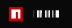
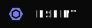

***Contacts***  
   [@alexandernechaenkov](https://t.me/alexandernechaenkov) 
    [kettl110e4@gmail.com](mailto:kettl110e4@gmail.com) 
    [kettl96#0171](https://discordapp.com/users/400360754588680204/)

***Languages and Tools:*** 

 

 

 
 

 

***Follow me:***  

 

<!---
kettl96/kettl96 is a ✨ special ✨ repository because its `README.md` (this file) appears on your GitHub profile.
You can click the Preview link to take a look at your changes.
--->
